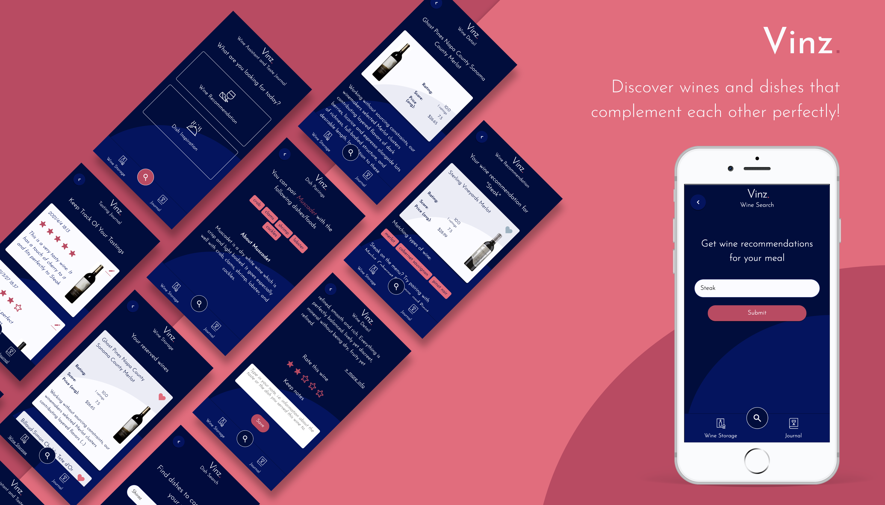

# 🍷 + 🍱 = Vinz.

## _**Vinz.**_ is your personal assistant that helps you discover wines and dishes that complement each other perfectly!

## Features ✨

🍷 Get **wine recommendations** based on dishes.

💖 Save wines you want to taste in your personal ****wine storage****

🍛 Find suitable meals for a particular wine via **_dish search_**

📔 Use your _**tasting journal**_ to keep track of a wine you have tried and add your personal _**rating**_ ⭐️ and _**taste experience**_ ✍️

## About ⚡️

> I love to cook with friends and try out new recipes and wines with them. For me it's the perfect way to share conviviality, pleasure and creativity.  
> Getting inspiration, however, is often cumbersome and time-consuming - as a layperson, choosing a suitable wine for a dish is difficult.   
> That gave me the idea for this app, which is my digital capstone project for the _neueFische_ **web development bootcamp**. 

## Tech & Tools 🚀

This project was bootstrapped with Create React App. Further tooling:

    Javascript ES6+
    React Router
    React Query
    Styled-Components
    Storybook
    Spoonacular API
    MongoDB Atlas
    Mongoose
    Node.js
    Express
    Jest
    React-Testing-Libary
    Cypress

## Running the project

You can clone my repository with:

HTTPS:
`$ git clone https://github.com/AnnekeSchuette/capstone-project.git`

SSH:
`$ git clone git@github.com:AnnekeSchuette/capstone-project.git`

## Available Scripts

In the project directory, please run:

`npm install`

## Preview

_hint: This gives you the source code of the app. Unfortunately you will need to request an API key from spoonacular.com to use the full functionality of this App when cloning the repository. You can set your API key via environmental variable or directly exchange it in the services files. Also you need to setup a MongoDB to save journal entries. Configure as you desire!_ 👩🏻‍🦰✌🏻
